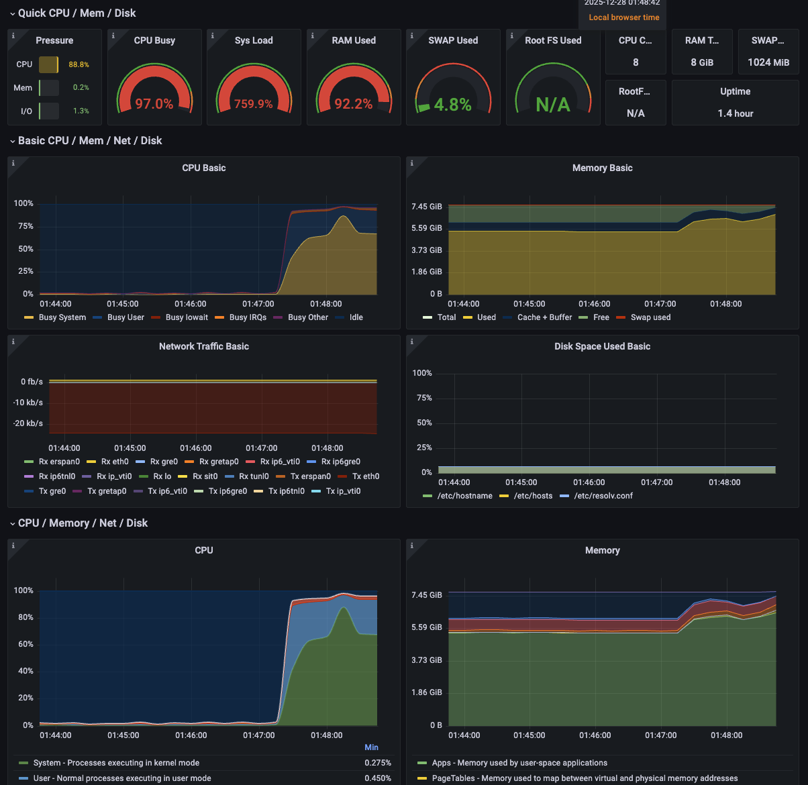
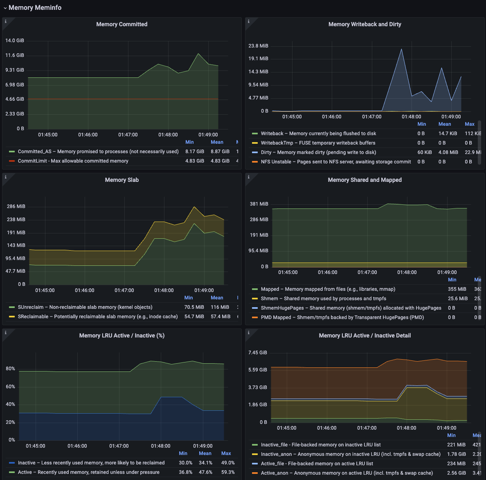
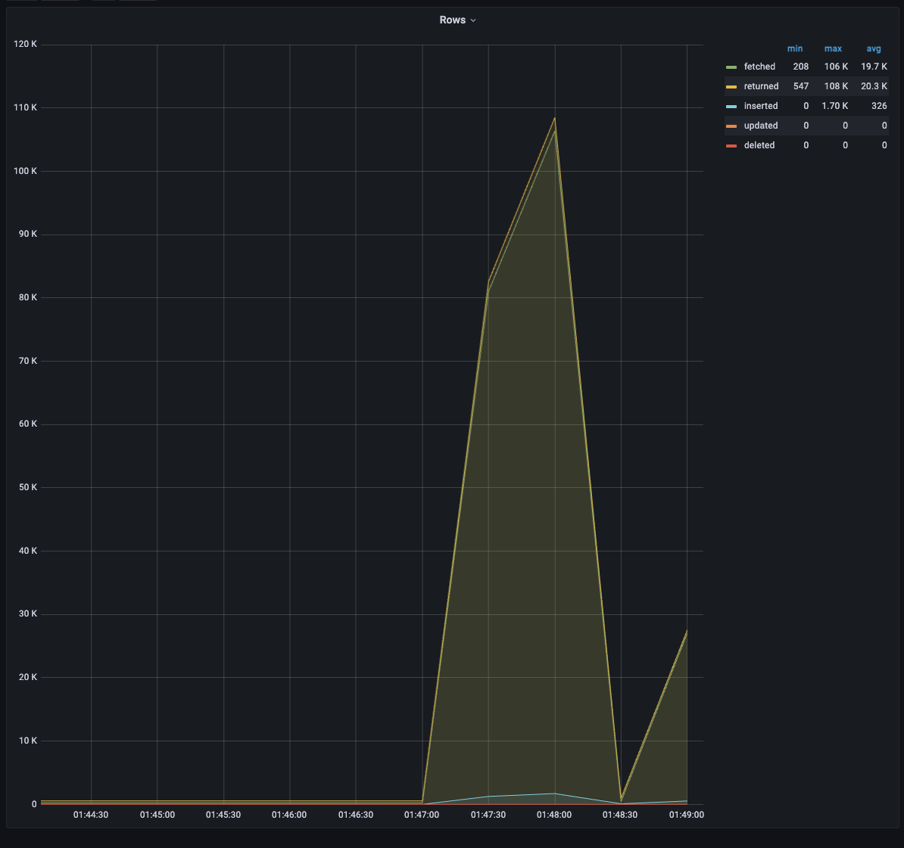
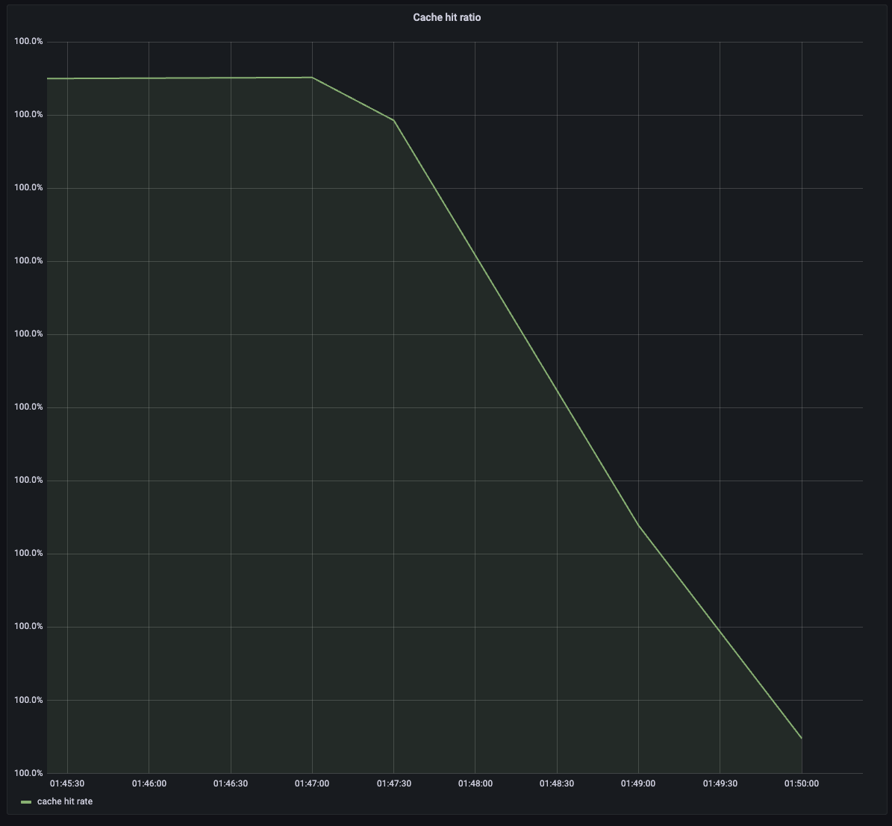
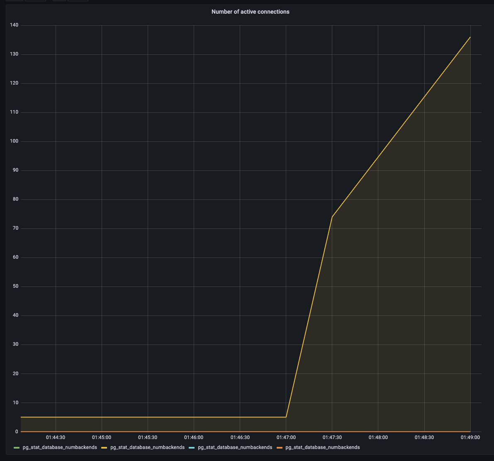
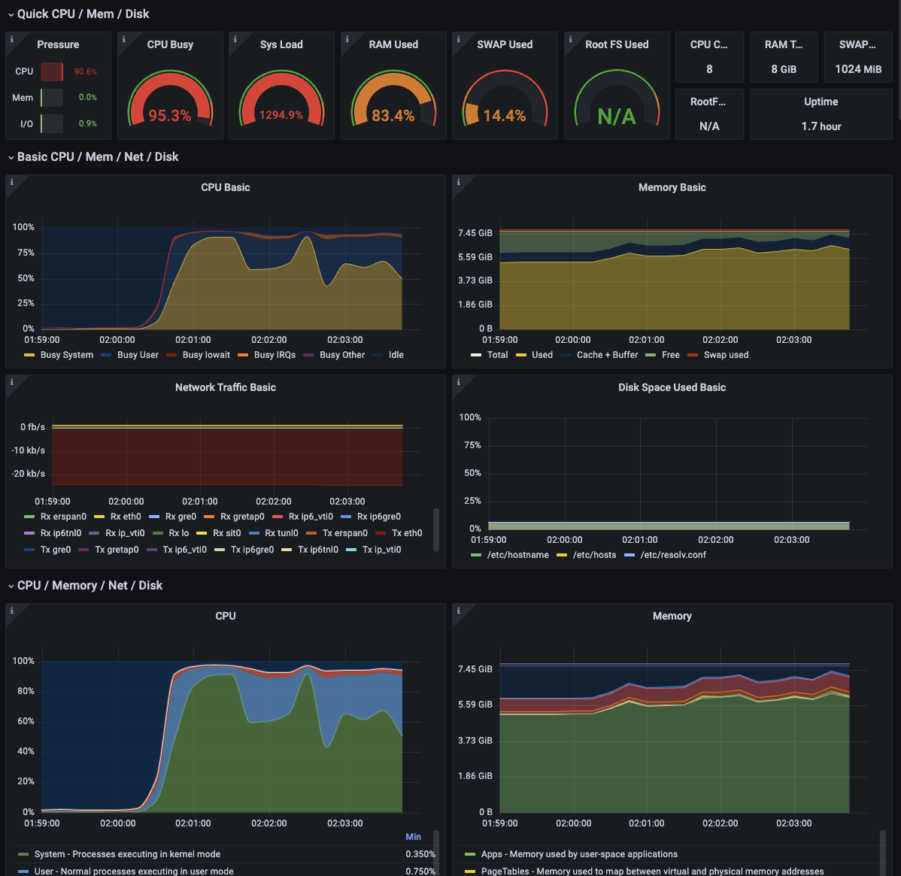
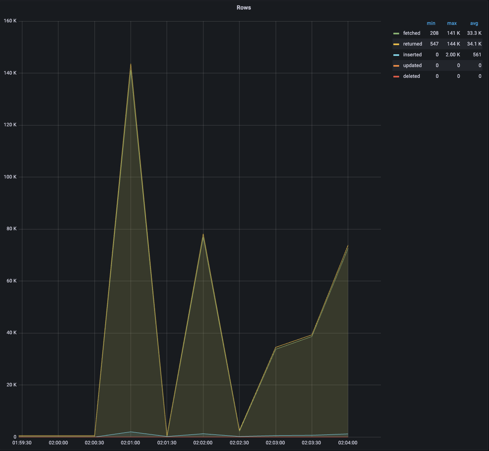
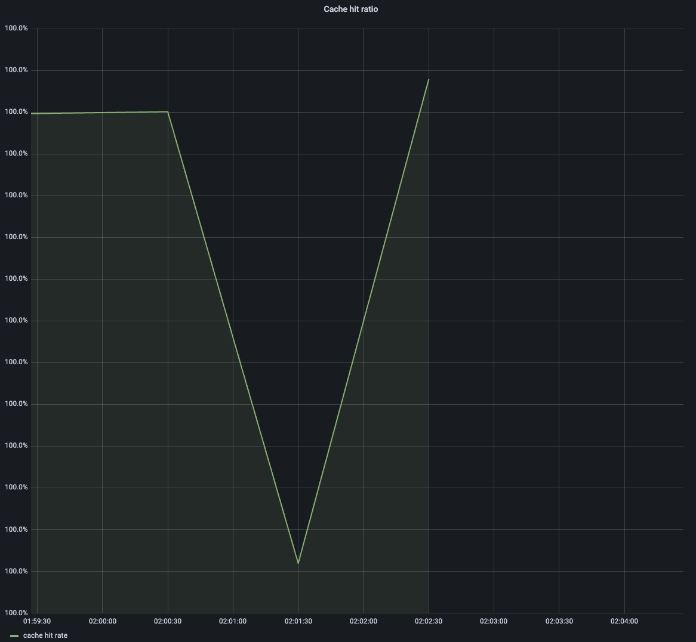

## Этап №1: Думаем и проектируем

### Анализ архитектуры

Тестируемая система — стандартное веб-приложение со следующей цепочкой обработки запросов:

NGINX выступает как веб-сервер и reverse proxy, backend реализует CRUD-операции и синхронно обращается к базе данных PostgreSQL. Метрики собираются Prometheus и визуализируются в Grafana.

Цель нагрузочного тестирования — понять поведение системы при росте нагрузки, выявить узкие места и определить пределы её устойчивости.

---

### Какие метрики нужно отслеживать

#### Метрики API / пользователя
- **Latency (время ответа HTTP-запросов)** — позволяет увидеть деградацию производительности, особенно по перцентилям.
- **Error rate (доля ошибок)** — рост ошибок указывает на отказ системы.
- **Request rate (RPS)** — показывает фактическую пропускную способность.

---

#### Метрики backend-приложения
- **Время обработки запросов по эндпоинтам**
- **Количество запросов и статус-коды**

---

#### Метрики базы данных
- **Время выполнения SQL-запросов**
- **Количество подключений к БД**
- **Нагрузка на БД (CPU, IO)**

---

#### Инфраструктурные метрики
- **CPU / Memory backend и PostgreSQL**
- **Disk IO и Network**

---

### Уже имеющиеся метрики

В системе уже присутствуют:
- HTTP-метрики backend (latency, количество запросов, статус-коды)
- Метрики времени выполнения SQL-запросов
- Инфраструктурные метрики (node-exporter, cAdvisor)
- Метрики PostgreSQL (postgres-exporter)
- Метрики нагрузки k6

---

### Метрики, которые можно добавить (опционально *)

Дополнительно полезными могли бы быть:
- количество активных соединений с БД;
- разделение SQL-метрик по типам операций;
- метрики saturation / очередей.

### Этап 2. Сценарий «Шторм»

#### Описание
Сценарий моделирует резкий и продолжительный всплеск нагрузки:
- быстрый рост до ~2000 виртуальных пользователей;
- длительность нагрузки ~3 минуты;
- минимальный think-time.

---

#### Ключевые моменты

**CPU**
- CPU Busy до ~97%, Sys Load до ~750–800%.
- Система находится в состоянии постоянной перегрузки по CPU.

**Memory**
- Использование RAM до ~92%.
- Фиксируется использование swap (до ~5%), что указывает на memory pressure.

**PostgreSQL**
- Число активных соединений возрастает до ~130–140.
- Резко растёт количество обрабатываемых строк.
- Cache hit ratio снижается во время шторма → нагрузка выходит за пределы эффективного кэша.

**Общее состояние**
- Система продолжает обслуживать запросы, но работает в деградированном режиме.
- После завершения нагрузки восстановление метрик происходит с задержкой.

#### Приложение: графики и метрики

### Этап 2. Сценарий «Волна»

#### Описание
Нагрузка увеличивается плавно: от 0 до ~1500 пользователей в течение ~2 минут.  

#### Ключевые моменты
- CPU и Sys Load росли постепенно, без мгновенного выхода в saturation
- Потребление памяти увеличивалось плавно, без резких скачков
- Количество активных соединений росло линейно
- Cache hit ratio временно снижался на пике нагрузки, затем частично восстанавливался
- База данных обрабатывала нагрузку стабильнее, чем в сценарии «Шторм»

**Вывод**  
Сценарий «Волна» показал более устойчивое поведение системы по сравнению с резким пиковым сценарием.  
Плавный рост нагрузки позволяет сервисам и базе данных адаптироваться, снижая риск деградации и делая узкие места (CPU, память, кэш) более наглядными и предсказуемыми.

### Скриншоты

## Этап №3: Анализ результатов

### Ключевые инсайты

- **CPU — первый bottleneck**  
  CPU Busy достигал **95–97%**, а System Load — **700–1200%**.Основным узким местом системы является backend-приложение, упирающееся в CPU. При росте нагрузки система не падает, но работает в режиме перегрузки.

- **База данных выдерживает нагрузку, но под давлением**  
  PostgreSQL не отваливался даже при пиковых сценариях, однако количество активных соединений возрастало до **130–150**, что увеличивает конкуренцию за ресурсы БД.

- **Снижение эффективности кэша под нагрузкой**  
  Cache hit ratio падал при росте нагрузки, что приводило к увеличению числа реальных обращений к базе данных и усиливало общее давление на систему.

- **Память — вторичный ограничивающий фактор**  
  Использование RAM доходило до **~90%**, в пиковые моменты начинался swap. Это указывает на работу системы в пограничном режиме при длительной нагрузке.

- **Разное поведение при разных профилях нагрузки**  
  Сценарий «Шторм» приводил к резкой деградации метрик, тогда как «Волна» показывала более стабильное и предсказуемое поведение системы при плавном росте нагрузки.

### Вывод
Система демонстрирует устойчивость и не переходит в отказ, однако её масштабируемость ограничена CPU backend-приложения и ростом нагрузки на PostgreSQL при снижении эффективности кэша.

## Этап №4: Предлагаемые решения

Для повышения устойчивости системы и улучшения масштабируемости под нагрузкой предлагаются следующие меры:

- **Горизонтальное масштабирование backend**  
  Запуск нескольких экземпляров backend-приложения за NGINX для снижения CPU-нагрузки на один инстанс.

- **Ограничение и настройка пула соединений к БД**  
  Введение лимитов на количество одновременных соединений и использование connection pooling для снижения давления на PostgreSQL.

- **Добавление прикладного кэша**  
  Использование Redis или аналогичного решения для кэширования часто запрашиваемых данных и снижения read-нагрузки на БД.
